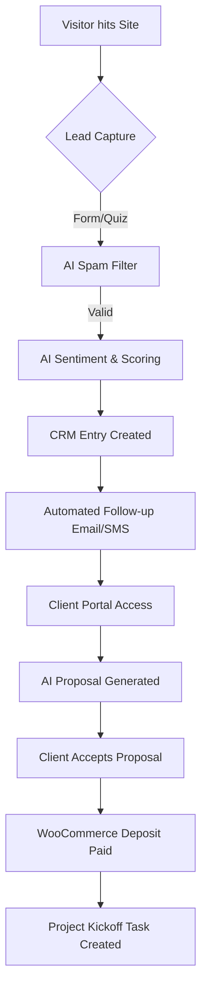
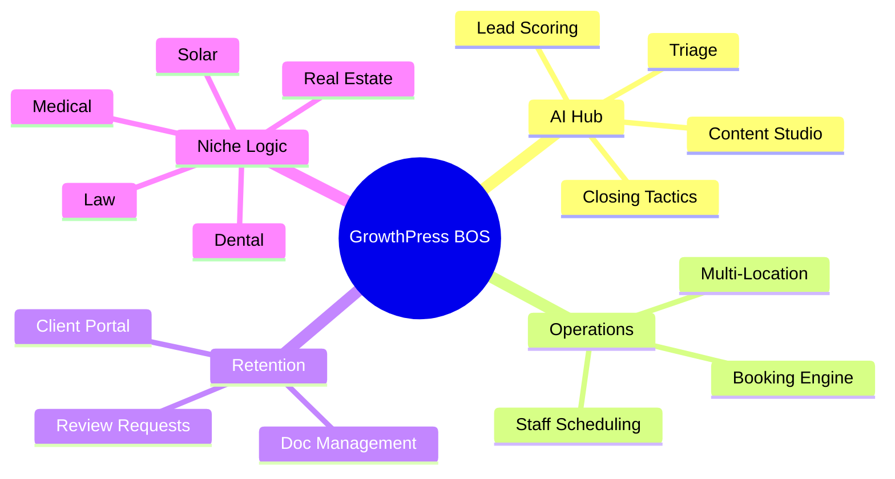
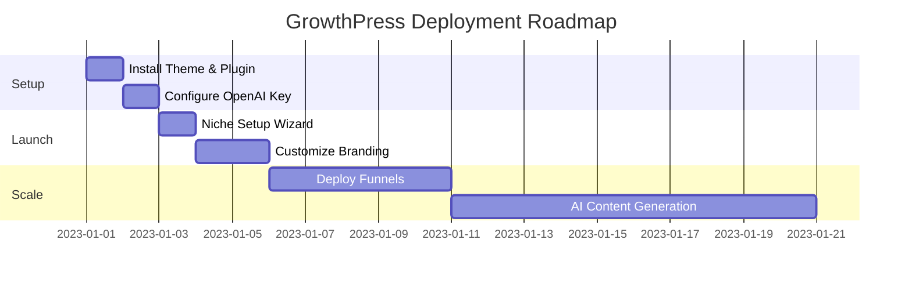

# GrowthPress System Map & Visual Guide

This document provides visual representations of how the GrowthPress Business Operating System functions.

## 1. The Core Flow (Lead-to-Cash)
This flowchart shows how a visitor becomes a paying client through AI automation.

## 2. Feature Ecosystem (Mindmap)
A high-level view of the modules included in the GrowthPress BOS.

## 3. Implementation Roadmap (User Onboarding)
The steps to take for a successful deployment.

## How it Works (Simple Explanation)
1. **The Intelligence**: GrowthPress uses GPT-4 to "read" every incoming lead, scoring them by urgency so you know who to call first.
2. **The Automation**: When a lead is captured, the system immediately sends a follow-up and builds a private portal for that client.
3. **The Efficiency**: You manage everything—leads, appointments, tasks, and marketing—from one unified SaaS-style dashboard.
